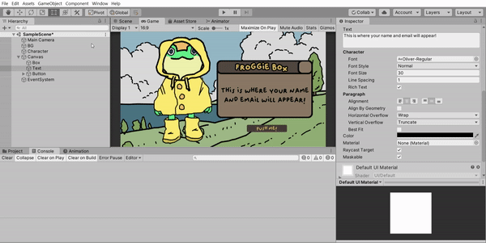

# MiniApp
4210181008 - Zsalsabilla Pasya Edelani.
Desain Multiplayer Game Online Assignment to make Mini Application.

1. Project Title: Mini App - Froggie Box.

2. Code:

using System.Collections;
using System.Collections.Generic;
using UnityEngine;
using UnityEngine.UI;
using SimpleJSON; //plug in to download JSON data.

public class CharaInfo : MonoBehaviour
{
    string jsonLink = "https://5e510330f2c0d300147c034c.mockapi.io/users"; //Link of data we need.
    public Text logText;

    public void getInfo() //Button func to show name and email.
    {
        WWW reqInfo = new WWW(jsonLink); //to get data from the JSON link.
        StartCoroutine(DownloadInfo(reqInfo)); //Coroutine to start the process.
    }

    IEnumerator DownloadInfo(WWW info) //Download function for data we need.
    {
        yield return info; //to return the data value so we can access it.
        logText.text = "Hello, <b>" + downloadName(info.text) + "!</b> Your email is <b>" + downloadEmail(info.text) + ".</b>"; //text that shows up on mini app.
    }

    string downloadName (string jsonName) //to get name data from JSON.
    {
        JSONArray arr = JSON.Parse(jsonName).AsArray; //Getting data from the array.

        return arr[8]["name"].Value; //on the index 8 and label name.
    }

    string downloadEmail (string jsonEmail) //to get email data from JSON.
    {
        JSONArray arr = JSON.Parse(jsonEmail).AsArray;

        return arr[8]["email"].Value; //on the index 8 and label email.
    }

}

3. Gif file: 

4. Descriptions:
Pertama-tama, kita harus mendownload data yang ada pada file JSON terlebih dahulu dengan menggunakan plug in simple JSON yang di-attach pada project Unity.
Setelahnya, buat script baru dan jangan lupa ketikkan 'using SimpleJSON' agar kita bisa menggunakan fungsi pada plug in.
Definisikan variabel string yang menyimpan link file JSON, link ini akan digunakan untuk mendownload data dengan menggunakan sintax WWW pada fungsi IEnumerator.
Untuk mendapatkan data nama dan email buatlah sebuah fungsi khusus dimana fungsi tersebut mengambil array data pada file JSON sesuai index dan data apa yang kita butuhkan.
Fungsi downloadName dan downloadEmail nantinya akan dipanggil pada fungsi DownloadInfo yang berjalan ketika pemain menekan tombol (berarti memulai coroutine).
Setelahnya kita dapat melihat nama dan email muncul pada text box yang disediakan sesuai index yang dimasukkan.
